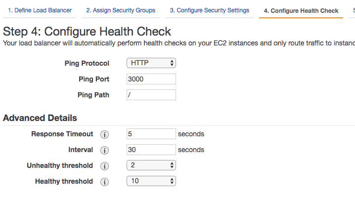
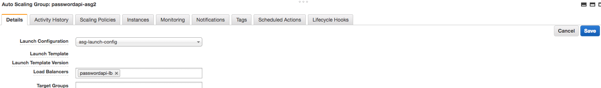

# Scalability Camp: Auto Scaling Lab

In this lab we are going to work on auto scaling an application.

This means that we will automatically add or remove instances of our application based on a metric, e.g. CPU usage.

## Create AMI of your application
The first thing we have to do is create an AMI that runs our application on start.

To do this, we will use [Upstart](http://upstart.ubuntu.com/).

### Install Upstart
We have to install Upstart in an instance where we have our application. To do this, follow these instructions:
```
sudo apt-get install -y upstart-sysv
sudo update-initramfs -u
# restart so the changes take effect
# and then remove system.d
sudo apt-get purge systemd -y
```

### Configure Upstart
Once we have done that, we have to copy the [upstart script](https://github.com/auth0-eng-camp/scalability-lab01/blob/master/passwordapi.conf_) we have from lab 01 and paste it in `/etc/init/`.

After this, check that the code of our application is in `/opt/passwordapi` since that's the folder where the script is going to look to run the application.

### Test Upstart configuration
Now we can test the script we have created, run `sudo start passwordapi` to see if the application starts running.

After doing this, reboot the instance and check that the application started. To do this simply direct your browser to the instance URL.
>Note: The instance public DNS may change when it restarts. Check this if you can't reach it with your browser or via SSH.

### Create the AMI
To create the AMI go to the AWS console and select the instance you have been modifying.
Then click on `Actions` -> `Image` -> `Create image`


## Create Auto Scaling Group
Now we will setup an Auto Scaling Group with the image that we just created.

### Create a Launch Configuration
The first thing we have to do to create an Auto Scaling Group is create a Launch Configuration that our ASG will use as a base.

To do this, go to `Launch Configurations` under `Auto Scaling` in the left menu.


Once there, select the AMI we previously created


Use the default instance type and in the detail configuration section simply add a name to your launch configuration such as `passwordapi-launch-config`

When you are in the `Configure Security Group` step remember to select the security group configuration that enables traffic on port 3000.


### Create ASG
Now we will use the `launch configuration` we created to setup an ASG. To do this, go to the `Auto Scaling Groups` section under `Auto Scaling` on the menu on the left.

Once there, select `Create Auto Scaling Group`. And then select the launch configuration you previously created.


After this, select a name for you ASG and use the default subnet.


Then we have to configure the Scaling Policies. A simple setup is to set the instances to go from 1 to 3, the metric type to `Avarage CPU Utilization` and the target value to around 70%.


Use the default values for the next steps and finish the setup of your ASG.

After this, you will see that a new instance started and that it belongs to our ASG.


## Create Elastic Load Balancer
Finally, we will need a load balancer that detects changes in the amount of instances and balances the load among them.

To do this, we have to go to the `Load Balances` section under `Load Balancing` in the left menu, and select `Create Load Balancer`.

Then we have to create a `Classic Load Balancer`

Select a name for your load balancer and remember to route traffic from port 80 of the load balancer to port 3000 of the instances.


In the security groups section, remember to select the policy that allows traffic to port 80.


Then we need to configure the Health checks. To do this, remember that we have to ping port 3000.



After this follow the next steps to finish the creation of the Load Balancer.
>Note: There is no need to select the instances yet.

### Configure Load Balancer in ASG
The last thing we have to do is assing the load balancer we just created to the ASG we have previously created.

To do this, go to `Auto Scaling Groups` and select you ASG.

Then click on `Actions` -> `Edit`


Then we have to select our load balancer in the load balancers label and save the configuration.



## Testing

Everything should be setup by now, so proceed to test your ASG by pointing JMeter to the load balancer and see how instances increase and decrease.

>Note: Depending on the configuration instances may take a while to start and terminate.

Go on and try different scaling configurations for your ASG to see how the scaling changes.
To do this, go to the `Auto Scaling Groups` section, select your ASG and go to the `Scaling policies` tab. There you can add policies or modify the one that you already have.


