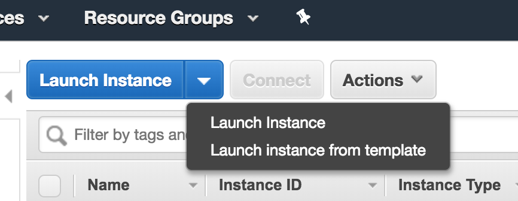
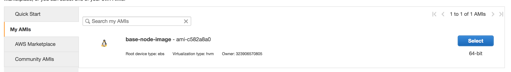

# Scalability Lab 03

In this lab we are going to work on load balancing multiple instances of the same application.

To do this, we are going to use [Nginx](https://www.nginx.com/) as our load balancer.

### Launch another instance of the app.
The first thing you need to do is launch another instance of the application used in labs [01](https://github.com/auth0-eng-camp/scalability-lab01) and [02](https://github.com/auth0-eng-camp/scalability-lab02).

To do this, select `launch instance` in the `instances` tab and then select `launch instance` from the drop menu that appears.

Once there, in the `My AMIs` tab, select the `base-node-image`

Configure it in the same way that you had done for lab 01 and then proceed to install and run the application.

### Launch Nginx instance
Once you have the application running in the new instance, we need to create another instance for Nginx.

To do this, follow the same steps that we used before but this time select `base-nginx-image` as your base `AMI`.
>Note:
Remember to allow traffic for port 80 instead of port 3000 for the Nginx instance.

After launching the instance, make sure `Nginx` is working by pointing your web browser at the instance domain or IP address.

### Configure Nginx
To configure Nginx we have to create a `default.config` file and put it inside the `/etc/nginx/conf.d/` folder in the Nginx instance.

Your config file should be similar to [this one](nginx/default.conf). Just change the URLs to match the ones of your intances.

Once you have added the config file, we need to remove the default Nginx configuration file that comes with a fresh installation so it doesn't override the config we just added.

To do this, simply remove the file `/etc/nginx/sites-enabled/default`

After doing this, simple run `sudo nginx -s reload` to tell Nginx to reload the configuration.

If you point your browser to the `/health` endpoint of the Nginx IP you should be able to see how you get answers from the different instances.

### Maintain affinity
Sometimes you want always route a user to the same instance that the user was routed the first time.

In this case, you simply need to add `ip_hash` to the Nginx configuration.

You can see an example [here](nginx/default-affinity.conf).